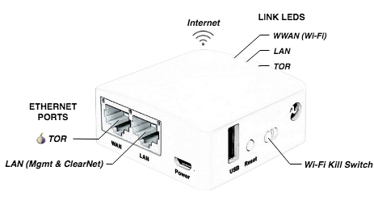

OnionWall
=========

Portable router to provide anonymous access to Internet via [Tor](https://www.torproject.org/about/overview).

It minimizes the risk of being caught in case an attacker gets into your computer while you are browsing anonymously with [Tor Browser](https://www.torproject.org/projects/torbrowser.html.en). It also reduces the potential to make fatal mistakes.

OnionWall enforces all Internet traffic to be sent over the Tor Network. It is the hardware alternative to the operating systems focused on anonymity like [Tails](https://tails.boum.org/) or [Whonix](https://www.whonix.org/).

The firmware is based on [OpenWrt](https://openwrt.org/) LEDE 17.01.6.

## Overview

OnionWall provides 3 network interfaces:

* **TOR**: Ethernet network with Tor listening on static IP **10.0.0.1**. All the traffic must be **explicitly proxied** to the port **9050**. Tor built-in DNS forwarder is listening on port **53** as well.
* **LAN**: Ethernet network for administration with DHCP server, SSH and Web Admin GUI listening on static IP **192.168.8.1**. It also has a HTTP proxy listening on port **8081** with unrestricted Internet access, useful for logging into captive portals.
* **WWAN**: Wireless network with DHCP client. Typically connected to your Internet uplink.

The Web Admin GUI is https://192.168.8.1. The default credentials are:
* Login: **_root_**
* Password: **_goodlife_**

To ensure security, OnionWall disables packet forwarding completely and administration must be performed on a separate channel from the proxied devices. It is not a [transparent proxy](https://trac.torproject.org/projects/tor/wiki/doc/TransparentProxy) for good reasons.

## Quick Start

* Purchase one of the [compatibles devices](#compatible-devices).
* Download the latest firmware and [flash it](https://gitlab.com/valldrac/onionwall/wikis/Flashing) onto the router.
* Connect your laptop to the LAN network and configure the Internet uplink.
* Get a dedicated laptop and remove all its radio devices (Wi-Fi and Bluetooth).
* Connect it to the TOR network and boot your preferred secure Linux distro.
* [Configure Tor Browser](#configure-tor-browser).
* Enjoy!

### Compatible Devices

| Device Type | Brand | Model | CPU MHz | CPU Cores | Flash MB | RAM MB | WLAN | Firmware |
|-|-|-|-|-|-|-|-|-|
| Wi-Fi Router | GL.iNet | [GL-AR150](http://www.gl-inet.com/ar150/) | 400 | 1 | 16 | 64 | b/g/n | [Download](https://gitlab.com/valldrac/onionwall/-/jobs/artifacts/master/browse/bin/targets/ar71xx/generic/?job=gl-ar150) |

### Configure Tor Browser

Go to `about:addons`, click on **Extensions** and disable the **TorLauncher** setting. After restarting the Tor Browser, go to `about:preferences#advanced`, select the **Network** tab, and configure **SOCKS** host **10.0.0.1** and port **9050**.

## Bugs

Never detach the antenna of the GL-AR150 when powered-on. It will damage the wireless chipset.

## Credits

Original idea by grugq's [portal](https://github.com/grugq/portal).

## Disclaimer

This project is NOT sponsored by The Tor Project. Use at your own risk.
